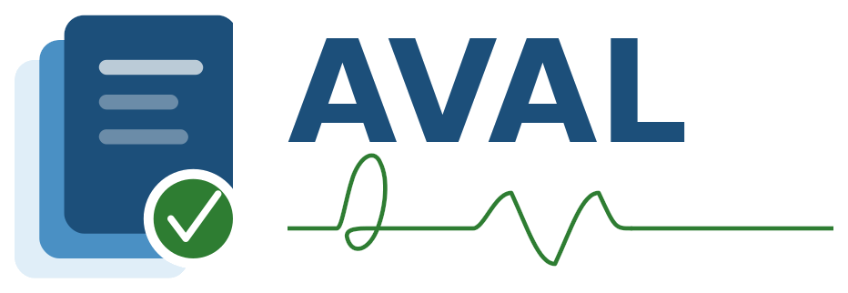

  

# Aval Parc

**Gestion de patrimoine pour établissements de santé** — équipements biomédicaux,
véhicules, mobilier, informatique. Démonstration en ligne : [avalparc.bsimr.com](https://avalparc.bsimr.com).

Aval Parc est un **fork suiveur** de [Snipe-IT](https://snipeitapp.com) (AGPL-3.0),
adapté au terrain hospitalier francophone : vocabulaire du patrimoine (affectations,
pointages d'inventaire, origines, n° de marché), configuration santé prête à
l'emploi, déploiement Docker **hors-ligne** pour serveur en établissement, et
outils d'import d'inventaires Excel existants.

| Pour… | Lire |
|---|---|
| Découvrir le produit et la couche Aval | [README-AVAL.md](../README-AVAL.md) |
| Installer en établissement (hors-ligne, sauvegardes, restauration) | [deploy/README.md](../deploy/README.md) |
| Mettre à jour depuis Snipe-IT | [docs/MISE_A_JOUR_UPSTREAM.md](../docs/MISE_A_JOUR_UPSTREAM.md) |
| Le registre des patchs upstream | [docs/UPSTREAM_PATCHES.md](../docs/UPSTREAM_PATCHES.md) |
| Générer la vidéo de démonstration | [demo-autopilot/README.md](../demo-autopilot/README.md) |
| La documentation Snipe-IT d'origine | [README.md](../README.md) |

Maintenu par **BSIMR** (Nouakchott, Mauritanie) · Licence AGPL-3.0 — le code
source complet, modifications incluses, est dans ce dépôt et servi par chaque
instance sur `/source.tar.gz`.
